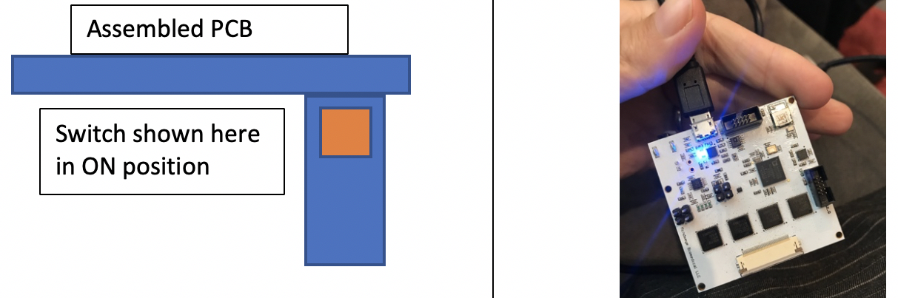
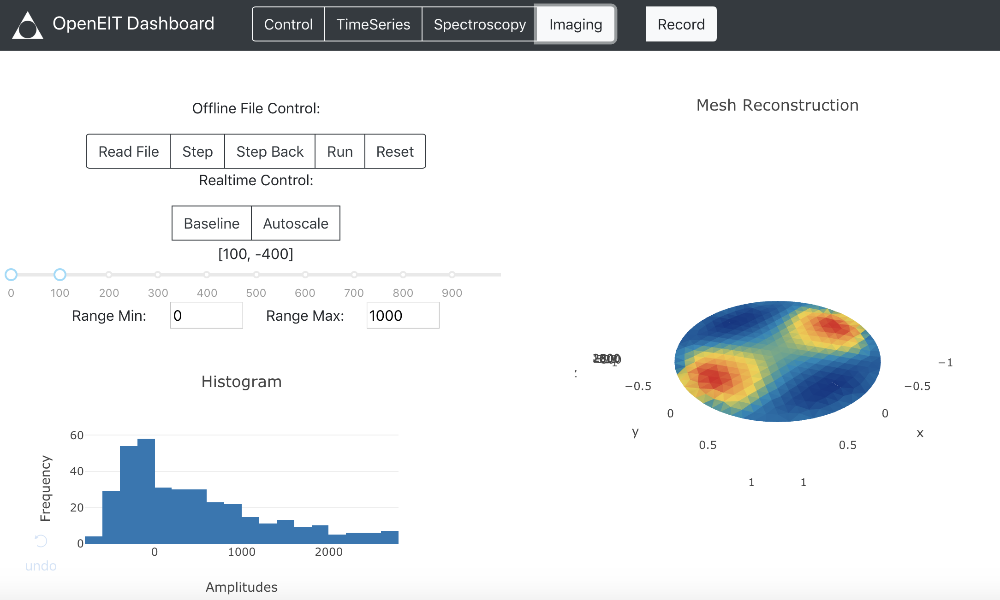
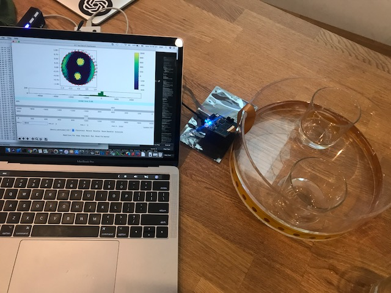
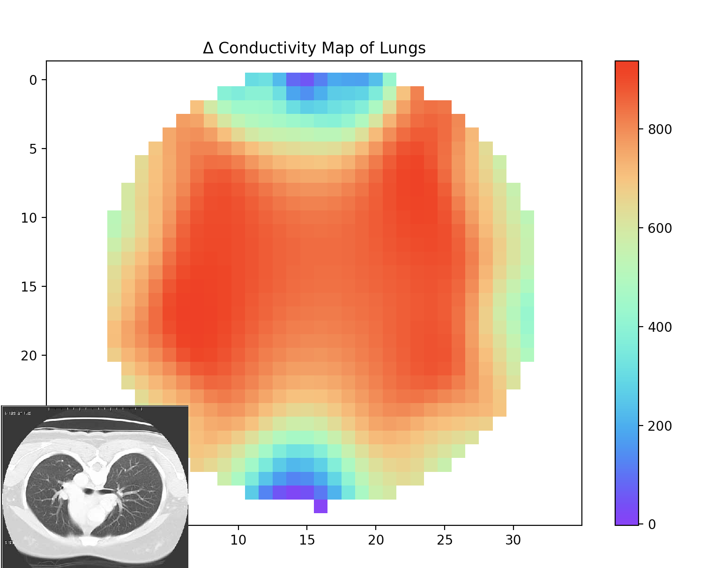

# OpenEIT Dashboard

Biomedical Imaging has previously been expensive and near impossible to hack and experiment with. If more people experimented and understood how imaging works we could move it forward much faster and make these transformative technologies available to everyone. OpenEIT(EIT is for electrical impedance tomography) uses non-ionizing AC current to recreate an image of any conductive material, such as your lungs, arm or head, using the same tomographic reconstruction technique as a CATSCAN. The PCB is only 2" square, with bluetooth, making it a portable and hackable way to do biomedical imaging!

## NOTE FOR WINDOWS USERS
SPECTRA uses an FTDI chip to communicate via UART. The VCP FTDI driver is not pre-installed on Windows(but is on all other OS's). If you are running a Windows machine you should follow these instructions to install the FTDI driver before continuing to the dashboard install: https://www.ftdichip.com/Drivers/VCP.htm


##  How to install the python dashboard. 

## Requirements
```
Python 3.6.7 
```

## Install
```
pip install -r requirements.txt

```
If you have any problems, it's likely that the requirements installation didn't complete, and you have incorrect versions of the modules installed. The following command will check the version of a single module, and you should check each module to ensure it is the same as listed in the requirements.txt file. 

```
pip show <package_name>

```

Alternatively you can run the following command to get a list of all installed modules. Before creating an issue in this repository regarding the installation process, check each version in the requirements.txt against your installed version. They should match! 

```
pip freeze

```

You can also install in a virtual environment following the directions below, which means any other python modules you have installed remain the same, and the EIT project will be in a separate sandbox. 

```
virtualenv -p python3 envtest

source envtest/bin/activate

git clone https://github.com/OpenEIT/OpenEIT.git

cd OpenEIT

pip install -r requirements.txt

python app.py 
```

## Make sure the button is in the 'ON' position. 

Plug in your microUSB cable if using with serial, then make sure that switch is turned on. Bluetooth and serial comms should now be active. 

<p align="center">
	
</p>


## Run
```
python app.py
```
You should now see the server running through the console at a server location accessible by any internet browser at Running on http://127.0.0.1:8050/. To see the dashboard open a browser window(I use chrome) to this address.

The dashboard should now be open and running and look like this: 

<p align="center">
	
</p>

## Functionality 

The dashboard can connect to the SPECTRA device via Bluetooth or Serial connection, do tomographic reconstructions in real-time, or by reading in offline data. You can also record data for later analysis. We suggest you have a look in the tutorials to try time series, bioimpedance spectroscopy and electrical impedance tomography functionality. [Tutorials](https://openeitgithubio.readthedocs.io/en/latest/)

<p align="center">
	
</p>


In the root OpenEIT folder there are a couple of extra scripts which are helpful when doing analysis. 

# offline.py 

Is an example of how to read in offline data for analysis outside the dashboard. It will read in a file created by simdata.py, or one that is saved by the dashboard. Read through this file, and modify it for your own application. This is an example, and do note that algorithms can be tuned and optimized. You can look at the pyEIT documentation to find more details on this. 

```
python offline.py

```

# simdata.py 

Simdata creates data in the same format as the hardware device, incase you want to do simulations before collecting real data. Simdata currently appends data to the simdata.txt file. Do note, that if you change parameters for recording, you should remove the pre-exisitng simdata file, so the data contained in it is all of the same format. 

Example usage:

```
python simdata.py

```

Outputs a simdata.txt file in the same format as the EIT dashboard. 

You can also use the main software to do either time series or bioimpedance spectroscopy. Instructions for these can be found in the readthedocs tutorials. 

<p align="center">
	
</p>

## Algorithms 

There are three classic EIT algorithms implemented - Back Projection, Graz Consensus and Gauss Newton Methods using the pyEIT toolbox - [pyEIT](https://github.com/liubenyuan/pyEIT). Each has many parameters which can be adjusted to get better results. It's also possible to create 3D meshes with this software in a similar manner to EIDORS(a matlab based EIT software suite). 

## License 

The Creative Commons Attribution-NonCommercial-ShareAlike 4.0 International License seems to fit best with this project. Basically your'e liable to keep any derivative works open, and if you want to do a private fork for a commercial application please contact us and pay a small fee(which goes towards the open source project next revision) either in cash or equity in your company. Check out the human readable summary here: 

<a rel="license" href="http://creativecommons.org/licenses/by-nc-sa/4.0/"></a><br />This work is licensed under a <a rel="license" href="http://creativecommons.org/licenses/by-nc-sa/4.0/">Creative Commons Attribution-NonCommercial-ShareAlike 4.0 International License</a>.

If you'd like to make a derivative of this project in a commercial setting, we'd love a payment in exchange for a commercial license so that we can afford to spend time both maintaining this project and making more projects like this one. If this hybrid open source model works, it would enable open source projects to receive some funding, making the global commons stronger to benefit everyone. 

## Donate! 
Are you using this effort? Is it helpful to you? Would you like to see it maintained, updated and perhaps a new iteration come out sometime? This project has taken a lot of time and effort! The best way to keep it going is to donate. 

<a class="dbox-donation-button" href="https://donorbox.org/donate-to-make-biomedical-imaging-more-accessible?hide_donation_meter=true" style="background:#2d81c5 url(https://d1iczxrky3cnb2.cloudfront.net/red_logo.png) no-repeat 56px center; color: #fff;text-decoration: none;font-family: Verdana,sans-serif;display: inline-block;font-size: 16px;padding: 17px 64px 17px 94px; -webkit-border-radius: 4px; -moz-border-radius: 4px; border-radius: 4px; box-shadow: 0 2px 0 0 #1f5a89; text-shadow: 0 1px rgba(0, 0, 0, 0.3);" ></a>


