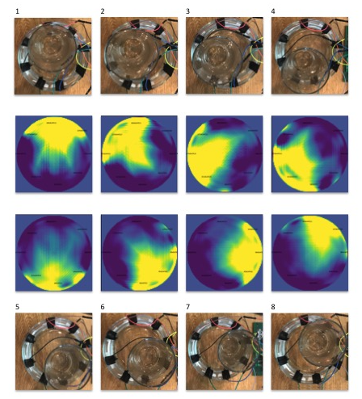

# EIT_Dashboard

Electrical Impedance Tomography is a new way to image conductivity changes inside any mostly liquid medium - such as the human body. It's attractive as it doesn't use ionizing radiation like the X-rays used in a CATSCAN, and could be relatively cheap to mass produce. 

This project is an example of a working system from PCB to firmware to reconstruction algorithm. Further work could certainly improve the resolution, but for now we have functionality in all sub sections. 

# How to use the dashboard. 

Dashboard for real-time EIT processing and image reconstruction using filtered linear back-projection.

python dashboard.py runs everything. 

If you don't have any of the dependencies installed you should get an error, otherwise the dashboard GUI should be ready to use. 

As you can see you can either save data streamed through the PCB via a serial connection for offline processing, or display the reconstruction in real-time. You can also read in a previosuly recorded file, and step through it one frame at a time. 

The sliders are completely configurable, and there is an option to baseline the image so you can adjust the colormap to be sensitive to smaller changes. The histogram functionality is intensive on the rendering so it's best not to over use it and use the menu item View->Dedicated Reconstruction Window once you have toggled the sliders sufficiently. Use the histogram distribution information to tune the sliders. You can also change the minimum and maximum range of the sliders in the text boxes below them. 

The dashboard uses the multiprocessing library to run the serial and reconstruction algorithms in different processes to improve efficiency. There is a ring buffer that takes the data from the serial port, and processes it. Snakeviz was used to profile the code to decrease the rendering time as this appears to be what uses the bulk of the processing time. The filtered back projection reconstruction takes a very short time as can be seen in the real-time processing reports to screen. 

Snake Viz General Instructions: 
==================================

Snakeviz Code Profiling instructions: 

pip install snakeviz 

Generate a cProfile: 
python -m cProfile -o program.prof my_program.py

Interpret results:  
snakeviz program.prof

