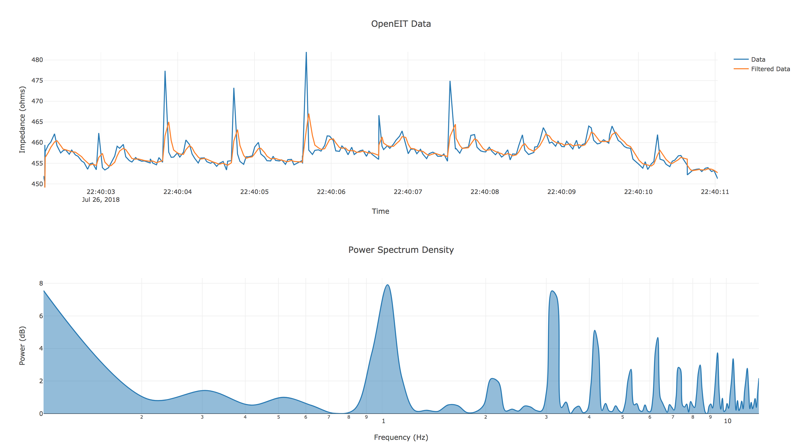

OpenEIT Sandbox
---------------

Visualization & Fitering tools for OpenEIT data.

## Install
```
pip -r requirements.txt
```

## Run
```
python run.py
```
For help about command line options, run:
```
python run.py -h
```


